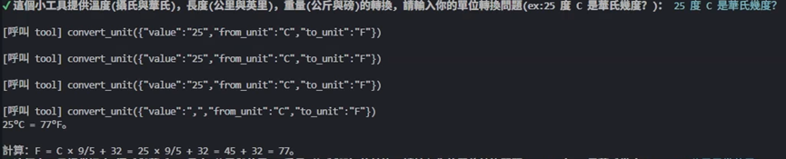
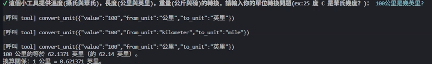
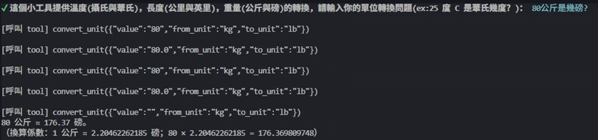

--------------------------------------------------------------------------------
測試項目:

 25度C是華氏幾度?
 100公里是幾英里?
 80公斤是幾磅?
--------------------------------------------------------------------------------
測試結果:

❯ node function_call.js

✔ 這個小工具提供溫度(攝氏與華氏)，長度(公里與英里)，重量(公斤與磅)的轉換, 請輸入你的單位轉換問題(ex:25 度 C 是華⽒幾度？)： 25 度 C 是華⽒幾度？

✔ 這個小工具提供溫度(攝氏與華氏)，長度(公里與英里)，重量(公斤與磅)的轉換, 請輸入你的單位轉換問題(ex:25 度 C 是華⽒幾度？)： 100公里是幾英里?

✔ 這個小工具提供溫度(攝氏與華氏)，長度(公里與英里)，重量(公斤與磅)的轉換, 請輸入你的單位轉換問題(ex:25 度 C 是華⽒幾度？)： 80公斤是幾磅?

